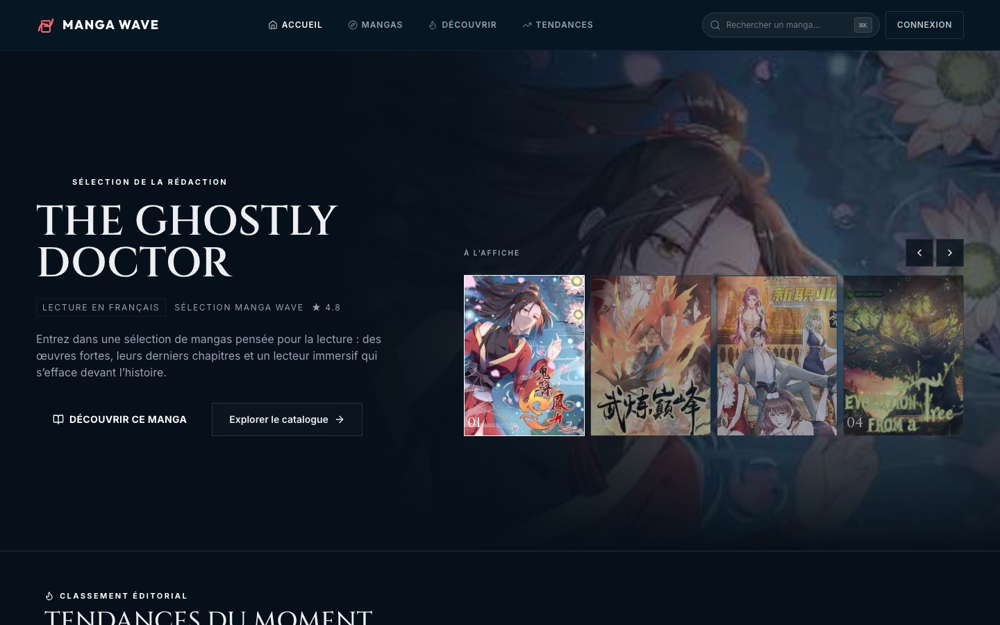
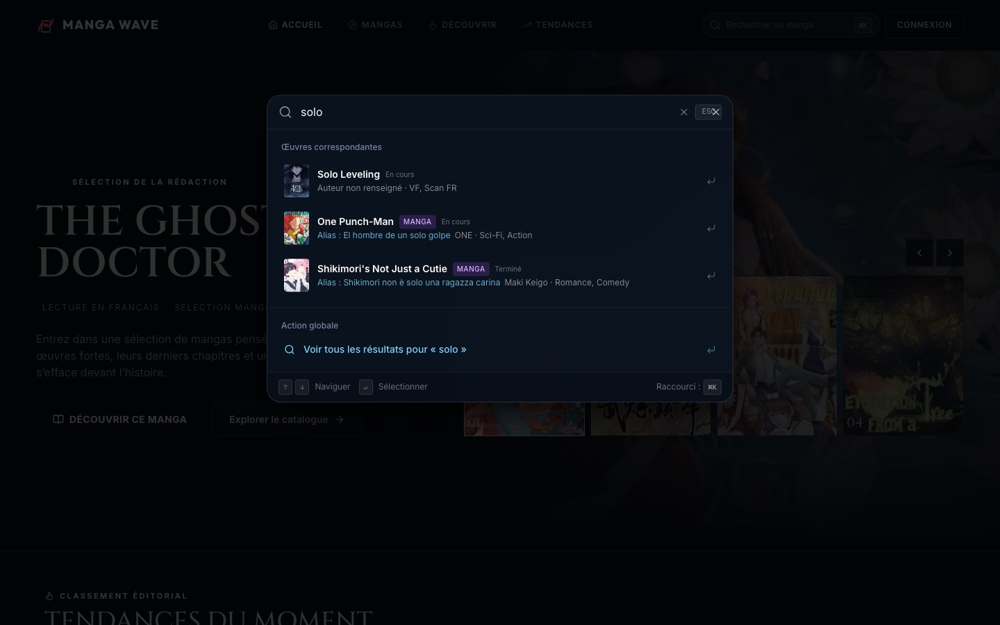
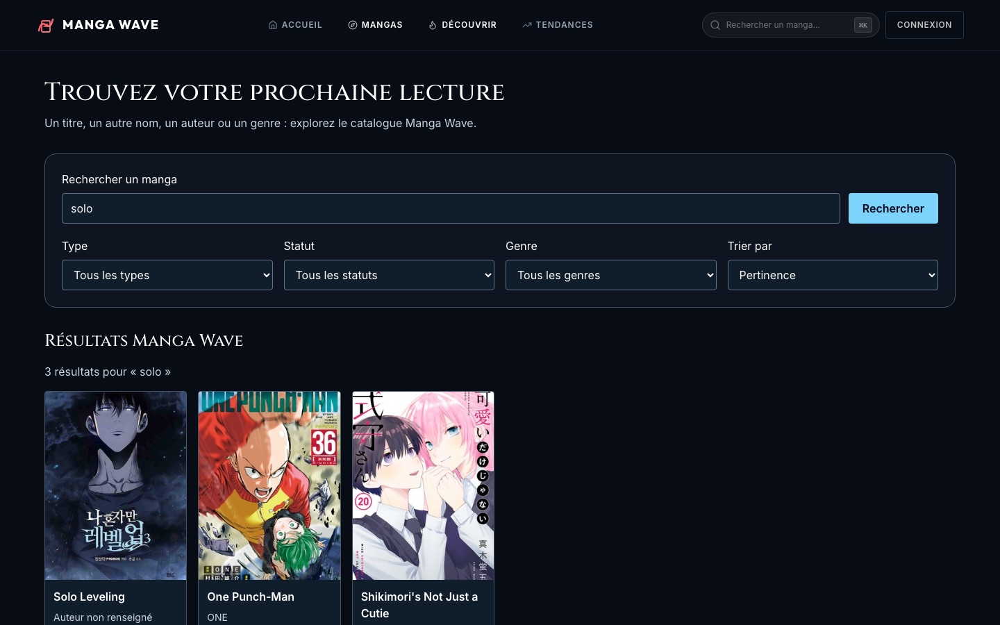
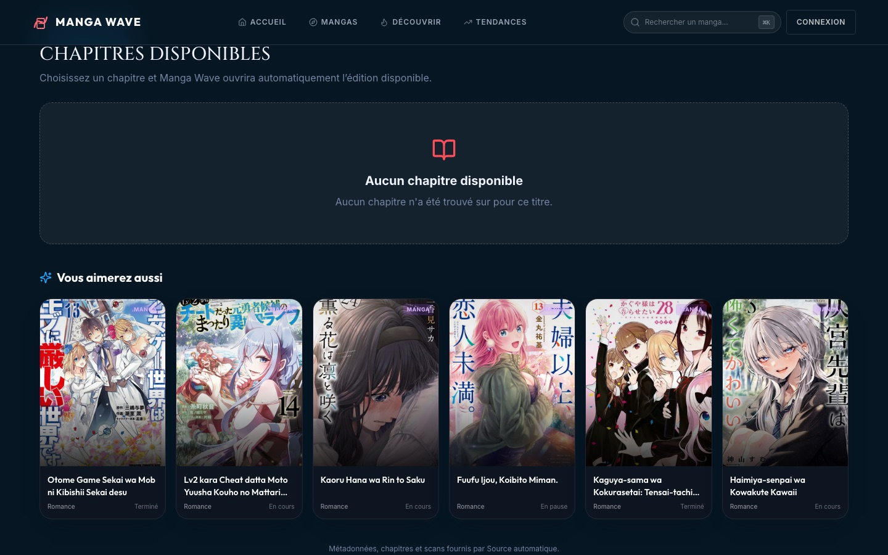
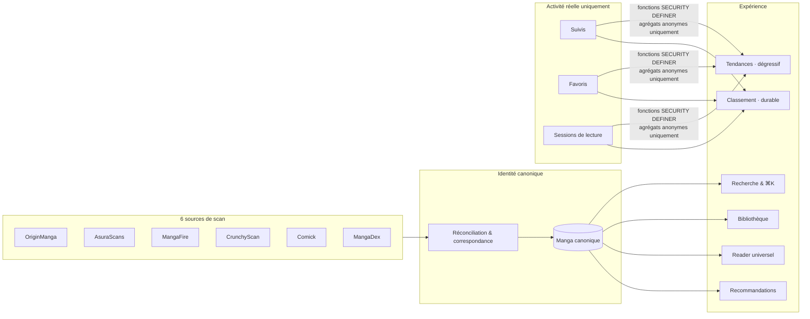
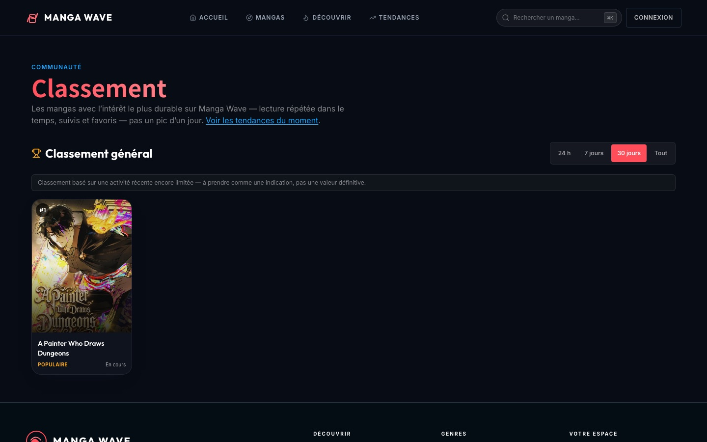

<div align="center">



# 🌊 Manga Wave

**Un seul lecteur. Un seul catalogue. Peu importe la source.**

Manga Wave fusionne plusieurs sites de scan en **une seule identité canonique par œuvre** —
recherche, suivi, progression, tendances et recommandations ne connaissent qu'un manga,
jamais un fournisseur.

[](https://manga-wave-bienvenue-fusion.vercel.app)
[](https://react.dev)
[](https://www.typescriptlang.org)
[](https://vitejs.dev)
[](https://supabase.com)
[](https://tailwindcss.com)
[](#-testé-vraiment-pas-symboliquement)
[](./LICENSE)

</div>

---

## ✨ Pourquoi Manga Wave existe

La plupart des agrégateurs de scans traitent chaque source comme un catalogue à part : le même
manga apparaît en double, triple, sextuple — une fois par site — avec des favoris, des historiques
et des notifications qui ne se parlent jamais entre eux.

Manga Wave part d'un principe inverse : **une œuvre, une identité, un état.**

Six sources (OriginManga, AsuraScans, MangaFire, CrunchyScan, Comick, MangaDex) sont réconciliées
en coulisses en un catalogue canonique unique. Tout le reste — recherche, palette de commandes,
bibliothèque, suivi, tendances, classement, recommandations — lit et écrit cet unique état.
Changer de source dans le Reader ne fait jamais perdre le chapitre ni la page.

<p align="center">
  
  <br/><sub>⌘K partout dans l'app — ici, « solo » retrouve <em>Solo Leveling</em> et l'alias espagnol de <em>One Punch-Man</em>.</sub>
</p>

## 🧩 Ce que ça fait, vraiment

| | |
|---|---|
| 🔀 **Multi-source, une seule fiche** | Six extracteurs de scan réconciliés en un catalogue canonique — bascule de source transparente dans le Reader, sans jamais perdre le chapitre ou la page. |
| ⌨️ **Command Search (⌘K)** | Recherche instantanée par titre, alias, auteur ou genre, sur tout le catalogue en cache — zéro appel réseau par frappe. |
| 📚 **Bibliothèque unifiée** | Favoris, suivis, progression et « à reprendre » d'une même œuvre convergent sur **une seule carte**, jamais dupliquée par source. |
| 🔔 **Suivi & notifications** | Un nouveau chapitre détecté sur n'importe quelle source déclenche une notification canonique unique — jamais une par site. |
| 📈 **Tendances** | Score agrégé, matérialisé et **dégressif dans le temps** (24h / 7j / 30j) sur l'activité réelle des lecteurs — jamais sur un compteur de vues figé. |
| 🏆 **Classement** | Popularité durable pondérée par lecture répétée dans le temps — architecture distincte des Tendances, mêmes fondations de confidentialité. |
| 🧠 **Recommandations** | « Vous aimerez aussi » calculé sur les genres, l'auteur et le format réels du catalogue — jamais une suggestion inventée. |
| 🔒 **Confidentialité par construction** | Toute agrégation multi-utilisateur passe par des fonctions `SECURITY DEFINER` qui ne renvoient que des agrégats anonymes — RLS intact, zéro identifiant utilisateur exposé, vérifié en direct. |

## 🖥️ En images

<table>
<tr>
<td width="50%"></td>
<td width="50%"></td>
</tr>
<tr>
<td align="center"><sub>Recherche canonique — titre, alias, auteur, genre, type</sub></td>
<td align="center"><sub>« Vous aimerez aussi » — similarité de contenu réelle, pas de placeholder</sub></td>
</tr>
</table>

## 🏗️ Architecture



## 🔬 Un principe qui a guidé tout le produit : **l'inconnu vaut mieux que le faux**

C'est la règle la moins visible et la plus structurante du projet. Concrètement :

- Le compteur `views` du catalogue n'est **jamais** incrémenté par l'application — c'est une
  donnée figée. Il n'alimente **aucun** classement, aucune tendance, nulle part.
- Un audit de production a montré que **54 % des notes stockées** étaient des constantes codées
  en dur par certains extracteurs (`4.8`, `4.9` partout) — pas une vraie note. Exclues du moteur
  de classement, pas seulement sous-pondérées.
- Quand l'activité réelle est trop faible pour un classement significatif, l'interface affiche
  honnêtement *« Pas encore assez d'activité »* — jamais un top 1 fabriqué à partir d'un clic isolé.
- Les alias multilingues, auteurs et genres exposés viennent d'un pipeline d'enrichissement à
  score de confiance (`EXACT` / `HIGH` / `REVIEW` / `REJECT`) — seules les correspondances sûres
  s'écrivent automatiquement.

<p align="center">
  
  <br/><sub>Capture réelle en production : l'app préfère l'admettre plutôt qu'inventer un classement.</sub>
</p>

## ✅ Testé, vraiment, pas symboliquement

- **233 tests unitaires** (Node test runner natif) sur la logique de canonicalisation, le
  matching de chapitres, le classement, les tendances, les recommandations, la confidentialité.
- **12 suites Playwright** avec de vraies bascules de source, de vrais comptes QA jetables, et des
  vérifications RLS en conditions réelles (un second utilisateur ne voit jamais les lignes d'un
  autre).
- Chaque fonctionnalité d'agrégation communautaire est validée **en production** après
  déploiement — migration, RPC, confidentialité et régression — avant d'être considérée terminée.

## 🛠️ Stack technique

**Frontend** — React 18 · TypeScript strict · Vite (Rolldown) · Tailwind CSS · shadcn/ui · TanStack
Query · React Router
**Backend** — Supabase (PostgreSQL, Row Level Security, fonctions `SECURITY DEFINER`, vues
matérialisées, `pg_cron`, Edge Functions)
**Qualité** — Node test runner · Playwright · ESLint · axe-core

## 🚀 Démarrer en local

```sh
git clone https://github.com/eulogep/manga-wave-bienvenue-fusion.git
cd manga-wave-bienvenue-fusion
npm install
npm run dev
```

Copiez `.env.example` vers `.env` et renseignez vos identifiants Supabase pour une instance
complète — l'application reste fonctionnelle en lecture seule sans configuration additionnelle
selon les modules consultés.

```sh
npm run test:p1      # cœur canonique (identité, matching, Reader)
npm run lint          # ESLint
npm run build         # build de production
```

## 📄 Licence

Propriétaire — tous droits réservés. Voir [LICENSE](./LICENSE). Manga Wave agrège des métadonnées
et des liens vers des œuvres hébergées par des sites tiers dont il ne détient pas les droits ;
aucune licence n'est accordée sur ce contenu.

---

<div align="center">
<sub>Construit avec une obsession : ne jamais présenter une donnée fabriquée comme une donnée réelle.</sub>
</div>
