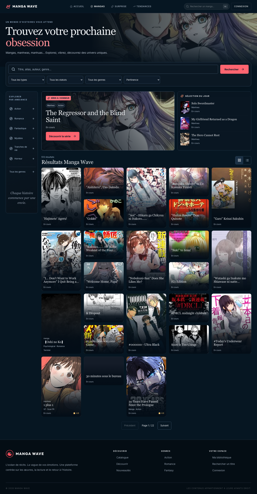
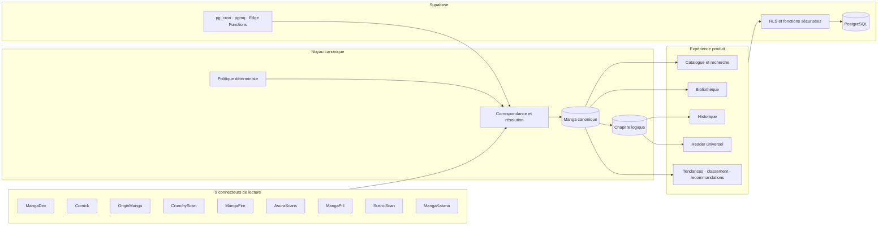

<div align="center">


# 🌊 Manga Wave

### Un catalogue canonique, plusieurs sources, une seule expérience de lecture.

Manga Wave réconcilie les œuvres issues de plusieurs fournisseurs sous une identité
canonique unique. La recherche, la bibliothèque, l’historique, la progression,
les notifications et les recommandations restent cohérents même lorsque la source
de lecture change.

[](https://manga-wave-bienvenue-fusion.vercel.app)
[](https://react.dev)
[](https://www.typescriptlang.org)
[](https://vite.dev)
[](https://supabase.com)
[](#-qualité-et-validation)
[](./LICENSE)

[Voir la production](https://manga-wave-bienvenue-fusion.vercel.app) ·
[Explorer le catalogue](https://manga-wave-bienvenue-fusion.vercel.app/search?browse=1) ·
[Consulter le kit vidéo](./video-kit/README.md)

</div>

---

## Le problème résolu

Un même manga peut exister chez plusieurs fournisseurs, avec des identifiants,
des langues et des numérotations de chapitres différents. Une application centrée
sur les fournisseurs finit alors par dupliquer les favoris, perdre la progression
ou notifier plusieurs fois le même chapitre.

Manga Wave utilise le manga canonique comme unité produit :

- une œuvre correspond à une fiche Manga Wave ;
- les sources restent des options de lecture secondaires ;
- la progression et l’historique suivent l’œuvre et le chapitre logique ;
- le Reader peut changer de fournisseur sans réinitialiser la page ;
- les signaux communautaires sont agrégés sans exposer l’identité des lecteurs.

## Nouveautés de l’expérience Manga Wave

### Carrousel éditorial « À l’affiche »

La page d’accueil propose désormais un carrousel manga-first alimenté par le
catalogue canonique et les tendances fiables :

- œuvre active centrée et voisines en perspective ;
- arrière-plan dérivé de la couverture active ;
- navigation clavier, flèches et swipe ;
- respect de `prefers-reduced-motion` ;
- images actives et adjacentes chargées en priorité ;
- CTA « Lire maintenant » via le résolveur canonique P1 ;
- aucune dépendance à un fournisseur dans l’interface principale.

### Catalogue éditorial pleine page

Le catalogue combine découverte visuelle et recherche structurée :

- hero éditorial et sélection du jour ;
- exploration par ambiance et genre ;
- recherche par titre, alias, auteur ou genre ;
- filtres type, statut et genre conservés dans l’URL ;
- tris par pertinence, popularité, note, récence ou ordre alphabétique ;
- vues grille et liste sans modifier l’ordre canonique ;
- responsive vérifié à 390 px, 430 px, tablette et desktop ;
- protection du contenu adulte conservée sur chaque point d’entrée.

<p align="center">
  
</p>

## Fonctionnalités

| Domaine | Comportement actuel |
| --- | --- |
| 🔀 **Résolution multi-source** | Classe uniquement les sources admissibles selon la langue, la disponibilité, la couverture du chapitre et la santé observée. |
| 🔎 **Recherche canonique** | Titre, alias multilingue, auteur, genre, typo bornée, filtres combinés et état URL reproductible. |
| ⌨️ **Command Search** | Palette globale `⌘K` / `Ctrl+K`, recherche locale instantanée et navigation vers les surfaces principales. |
| 📚 **Bibliothèque V2** | Favoris, suivis, œuvres en cours, mises à jour non lues, recherche et tri sans doublon fournisseur. |
| 🕘 **Historique canonique** | Chronologie de lecture, reprise à la page exacte, suppression d’une entrée ou effacement de l’historique sans supprimer la progression. |
| 🔔 **Suivi et notifications** | Une notification canonique par nouveau chapitre logique, état lu/non lu et isolation RLS par utilisateur. |
| 📈 **Tendances** | Score dégressif 24 h / 7 j / 30 j calculé sur l’activité réelle, avec seuil minimal de confiance. |
| 🏆 **Classement** | Engagement durable borné par utilisateur et par fenêtre temporelle, distinct du moteur de tendances. |
| 🧠 **Recommandations** | Similarité déterministe par genres, auteur et format ; aucune recommandation fabriquée sans signal commun. |
| 🎲 **Surprends-moi** | Tirage aléatoire dans le catalogue canonique, filtrable par type et statut, sans trafic fournisseur. |
| 📖 **Reader universel** | Navigation par pages, contrôles auto-masqués, reprise exacte, changement manuel ou automatique de source. |
| 📱 **PWA et responsive** | Shell installable, routes secondaires chargées à la demande, cache hors ligne limité aux ressources publiques sûres. |

## Fournisseurs et résilience

Le backend connaît actuellement neuf connecteurs :

`MangaDex` · `Comick` · `OriginManga` · `CrunchyScan` · `MangaFire` ·
`AsuraScans` · `MangaPill` · `Sushi-Scan` · `MangaKatana`

Leur présence dans le code ne garantit pas leur disponibilité permanente. Chaque
requête passe par une politique commune : HTTPS obligatoire, timeout, cache borné,
déduplication des appels concurrents, cadence par origine, retries limités sur les
erreurs transitoires et circuit breaker. Un `403` déterministe échoue fermé sans
contournement anti-bot automatique.

La synchronisation combine :

- un rafraîchissement MangaDex quotidien vers le catalogue canonique ;
- une file multi-source `pgmq` consommée par une Edge Function planifiée ;
- des écritures idempotentes ou explicitement bornées ;
- une santé fournisseur observable, sans rendre l’application dépendante d’une
  source unique.

Détails : [guide de synchronisation](./docs/catalog-sync.md) et
[architecture anti-bot](./docs/anti-bot-architecture.md).

## Architecture


```mermaid
flowchart LR
    subgraph Providers["9 connecteurs de lecture"]
        P1[MangaDex]
        P2[Comick]
        P3[OriginManga]
        P4[CrunchyScan]
        P5[MangaFire]
        P6[AsuraScans]
        P7[MangaPill]
        P8[Sushi-Scan]
        P9[MangaKatana]
    end

    subgraph Core["Noyau canonique"]
        Resolve[Correspondance et résolution]
        Manga[(Manga canonique)]
        Chapter[(Chapitre logique)]
        Policy[Politique déterministe]
        Resolve --> Manga --> Chapter
        Policy --> Resolve
    end

    subgraph Product["Expérience produit"]
        Search[Catalogue et recherche]
        Library[Bibliothèque]
        History[Historique]
        Reader[Reader universel]
        Signals[Tendances · classement · recommandations]
    end

    Providers --> Resolve
    Manga --> Search
    Manga --> Library
    Chapter --> History
    Chapter --> Reader
    Manga --> Signals

    subgraph Data["Supabase"]
        DB[(PostgreSQL)]
        RLS[RLS et fonctions sécurisées]
        Jobs[pg_cron · pgmq · Edge Functions]
    end

    Product --> RLS --> DB
    Jobs --> Resolve
```

## Une règle produit : l’inconnu vaut mieux que le faux

Manga Wave refuse de transformer une donnée faible en certitude :

- les compteurs historiques de vues ne deviennent pas automatiquement un signal
de tendance ;
- les notes constantes ou non fiables sont exclues des classements réels ;
- une activité insuffisante produit un état vide honnête ;
- les enrichissements de métadonnées suivent des niveaux `EXACT`, `HIGH`,
  `REVIEW` et `REJECT` ;
- une ambiguïté d’identité reste en revue au lieu de fusionner deux œuvres ;
- un chapitre absent n’est jamais remplacé silencieusement par le chapitre 1.

## TypeSafe AI / Jev

Jev est présent uniquement comme **expérience shadow**. Il observe éventuellement
une décision déjà prise par les règles, mais ne peut ni modifier la décision exécutée,
ni déclencher une écriture, ni devenir un point de panne du Reader.

```text
CLASSIFICATION: EXPERIMENTAL
PRIMARY_ENGINE: deterministic rules
AUTONOMY: disabled
FAILOVER: existing decision preserved
```

Sans clé, aucun appel réseau n’est effectué. Les erreurs 401, 429, 500, 529,
timeout, JSON invalide ou dérive de modèle conservent la décision déterministe.
Le jeu historique actuel est insuffisant pour calibrer un seuil d’autonomie fiable.

Voir [l’évaluation complète](./docs/typesafe-jev-experiment.md).

## Kit vidéo

Le dépôt contient un kit de production complet :

- rough-cut 16:9 de 40,4 secondes en 1920×1080 ;
- captures desktop, mobile et audit de production ;
- références de couvertures et manifeste ;
- logos SVG et PNG transparent ;
- storyboards 16:9, 9:16 et master ;
- scripts de voix, motion guide, sound design et matrice de capture.

### Regarder la démonstration

[](https://manga-wave-bienvenue-fusion.vercel.app/media/manga-wave-presentation-16x9.mp4)

▶ **[Regarder la vidéo en plein écran](https://manga-wave-bienvenue-fusion.vercel.app/media/manga-wave-presentation-16x9.mp4)**

La vidéo dure 40,4 secondes et peut aussi être téléchargée depuis le lecteur du navigateur.

[Ouvrir le kit vidéo complet](./video-kit/README.md)

## Confidentialité et sécurité

- Row Level Security sur les données personnelles.
- Progression, bibliothèque, historique et notifications isolés par utilisateur.
- Fonctions communautaires limitées à des agrégats anonymes.
- Clés administratives absentes du navigateur et des variables `VITE_*`.
- Sources externes limitées à HTTPS et contrôlées par une politique réseau commune.
- Contenu adulte protégé par une confirmation explicite conservée côté client.
- Jev ne dispose d’aucun droit d’exécution ou de mutation.

## Qualité et validation

Validation locale exécutée le 7 octobre 2026 :

- **292/292 tests unitaires PASS** avec le test runner Node ;
- **TypeScript PASS** avec `tsc --noEmit` ;
- **Build Vite PASS** ;
- **ESLint PASS**, zéro erreur et 61 avertissements historiques Fast Refresh ;
- catalogue et carrousel validés avec Playwright sur 390×844, 430×932,
  tablette et desktop ;
- navigation clavier, swipe, touch targets, reduced motion, overflow et axe-core
  couverts par les scénarios E2E ;
- smokes de production exécutés après déploiement pour les surfaces restaurées.

Les tests couvrent notamment la canonicalisation, le matching exact des chapitres,
les fallbacks, les métadonnées, la bibliothèque, l’historique, les notifications,
les tendances, le classement, les recommandations, la recherche, le Reader, la
résilience fournisseur, la PWA et l’expérience Jev shadow.

## Stack technique

| Couche | Technologies |
| --- | --- |
| Frontend | React 18, TypeScript strict, Vite/Rolldown, React Router, TanStack Query |
| Design | Tailwind CSS, shadcn/ui, CSS éditorial dédié, Lucide |
| Backend | Node/Express, extracteurs typés, cache et circuit breaker |
| Données | Supabase PostgreSQL, RLS, RPC, Edge Functions, `pg_cron`, `pgmq` |
| Qualité | Node test runner, Playwright, axe-core, ESLint |
| Déploiement | GitHub, Vercel, Supabase |

## Démarrage local

### Prérequis

- Node.js compatible avec le projet ;
- npm ;
- une configuration Supabase pour les fonctions nécessitant des données réelles.

```bash
git clone https://github.com/eulogep/manga-wave-bienvenue-fusion.git
cd manga-wave-bienvenue-fusion
cp .env.example .env
npm ci
npm run dev
```

Variables publiques attendues, sans valeur secrète dans Git :

```text
VITE_SUPABASE_URL
VITE_SUPABASE_PUBLISHABLE_KEY
VITE_MANGADEX_API_PROXY_URL
VITE_MANGADEX_COVER_PROXY_URL
VITE_MANGADEX_PROXY_PUBLISHABLE_KEY
VITE_MANGA_PROXY_URL
```

Lancer le frontend et le serveur d’extraction ensemble :

```bash
npm run dev:full
```

## Commandes utiles

```bash
npm run lint                 # ESLint
npx tsc --noEmit             # TypeScript
npm run build                # Build de production
npm run test:p1              # Canonicalisation, sources et Reader
npm run test:p2              # Personnalisation et UX source-first
npm run test:t3020           # Recherche canonique
npm run test:t3025           # Découverte aléatoire
npm run test:provider-resilience
node --experimental-strip-types --test tests/*.test.ts
```

Les tests E2E ciblent par défaut la production. Pour une instance locale :

```bash
PLAYWRIGHT_BASE_URL=http://127.0.0.1:5173 npx playwright test
```

## Documentation

| Document | Sujet |
| --- | --- |
| [Synchronisation du catalogue](./docs/catalog-sync.md) | Jobs, file multi-source, sécurité et exploitation |
| [Fournisseurs](./docs/catalog-providers.md) | Contrats et état des connecteurs |
| [Architecture anti-bot](./docs/anti-bot-architecture.md) | Limites, backoff et comportement fermé |
| [Catalogue éditorial](./docs/catalogue-editorial-validation.md) | Responsive, accessibilité et navigation |
| [Carrousel premium](./docs/featured-carousel-validation.md) | Sélection, performance et interactions |
| [Expérience TypeSafe/Jev](./docs/typesafe-jev-experiment.md) | Benchmark, failover et limites |
| [Roadmap](./docs/product-roadmap.md) | Évolution fonctionnelle du produit |
| [Kit vidéo](./video-kit/README.md) | Rough-cut, captures et montage |

Les rapports `MANGA_WAVE_V3_*_REPORT.md` conservent les validations datées de
chaque incrément. Ils constituent des preuves historiques et non un statut temps
réel des services externes.

## Licence et contenu tiers

Projet propriétaire — tous droits réservés. Voir [LICENSE](./LICENSE).

Manga Wave agrège des métadonnées et des liens vers des œuvres hébergées par des
services tiers. Le dépôt n’accorde aucune licence sur ces œuvres, couvertures ou
contenus externes. Chaque fournisseur conserve ses propres conditions d’utilisation
et peut devenir temporairement indisponible.

---

<div align="center">

**Manga Wave — une œuvre, une identité, une progression.**

</div>
