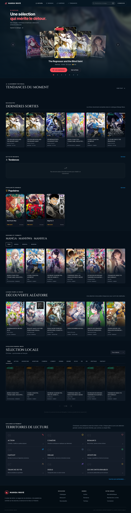

# Manga Wave — Video Production Kit

Ce dossier rassemble le master de travail, les captures, les références
visuelles et les documents nécessaires au montage de la vidéo Manga Wave.

> **État actuel :** un rough-cut 16:9 est disponible. Il présente le parcours
> produit, mais ne constitue pas encore la vidéo finale : la voix, la musique,
> les textes animés et le sound design restent à intégrer.

## 🎬 Rough-cut disponible

[](./video/manga-wave-master-16x9-roughcut.mp4)

### [▶ Ouvrir ou télécharger le rough-cut 16:9](./video/manga-wave-master-16x9-roughcut.mp4)

| Fichier | Définition | Durée | Cadence | Taille | Audio |
| --- | ---: | ---: | ---: | ---: | --- |
| `manga-wave-master-16x9-roughcut.mp4` | 1920 × 1080 | 40,4 s | 25 i/s | 14,7 Mio | Aucune piste |

Le rough-cut montre l’accueil, le carrousel éditorial, le catalogue de
découverte, la recherche, une fiche manga et le Reader. Il fixe l’ordre des
séquences et sert de base au montage final.

## Contenu du kit

| Dossier ou fichier | Contenu |
| --- | --- |
| `video/` | Master MP4 actuellement généré |
| `screenshots/desktop/` | Captures du candidat local sur desktop |
| `screenshots/mobile/` | Captures du candidat local sur mobile |
| `screenshots/audit-production/` | Captures du bundle réellement servi pendant l’audit |
| `artwork-references/` | Couvertures sélectionnées et manifeste de provenance |
| `branding/` | Logos SVG et export PNG transparent |
| `docs/` | Brief, scripts, plans de capture, motion et sound design |
| `recordings/` | Clips bruts locaux, volontairement exclus de Git |
| `storyboard-*.md` | Storyboards 16:9, 9:16 et master |

Les captures locales et les captures de production restent séparées afin de
ne jamais présenter un écran local non déployé comme une preuve de production.

## Régénérer les captures

Captures publiques principales :

```bash
VIDEO_BASE_URL=http://127.0.0.1:8080 node scripts/video/capture-video-kit.mjs
```

Captures avec Bibliothèque, Historique et Continuer la lecture, via un compte
QA éphémère :

```bash
VIDEO_BASE_URL=http://127.0.0.1:8080 VIDEO_CREATE_TEMP_ACCOUNT=1 node scripts/video/capture-video-kit.mjs
```

Le compte QA et ses données sont supprimés pendant le nettoyage. Aucune clé ni
aucun identifiant n’est écrit dans le kit.

Capturer le Reader réel de production et vérifier trois pages :

```bash
node scripts/video/capture-production-reader.mjs
```

Régénérer les références de couvertures et les exports de marque :

```bash
node scripts/video/export-artwork-references.mjs
node scripts/video/export-branding.mjs
```

## Préparer le montage final

1. Valider l’ordre des plans dans `storyboard-master.md`.
2. Sélectionner les clips bruts conservés dans `recordings/`.
3. Intégrer la voix à partir de `docs/voiceover-scripts.md`.
4. Ajouter les transitions décrites dans `docs/motion-guide.md`.
5. Appliquer le plan sonore de `docs/sound-design-guide.md`.
6. Exporter puis vérifier les versions 16:9 et 9:16.

## Documents prioritaires

- [`OPUS_5_5_HANDOFF.md`](./OPUS_5_5_HANDOFF.md)
- [`VALIDATION_REPORT.md`](./VALIDATION_REPORT.md)
- [`docs/product-truth-sheet.md`](./docs/product-truth-sheet.md)
- [`docs/shot-list.md`](./docs/shot-list.md)
- [`docs/capture-matrix.md`](./docs/capture-matrix.md)
- [`docs/featured-titles.md`](./docs/featured-titles.md)

Les audits DOM reproductibles se trouvent dans
`docs/capture-audit-candidate.json` et `docs/capture-audit-production.json`.
